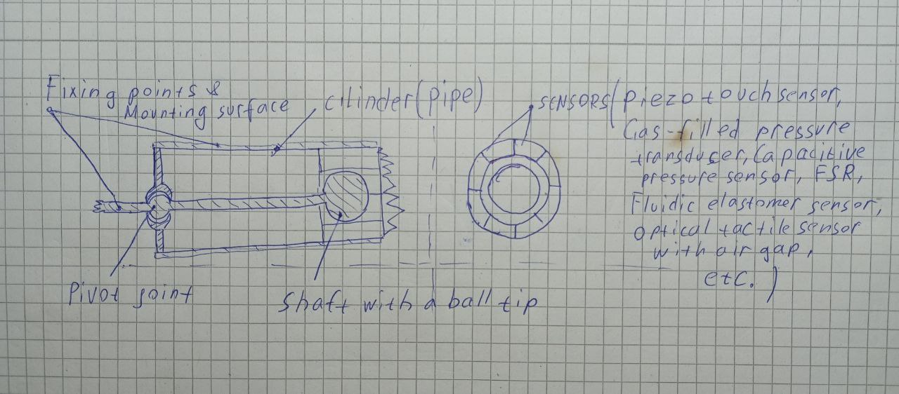

# Proprioceptive Positional Pressure Sensor

This repository contains the concept description for a proprioceptive pressure sensor designed by Andrii Tsybin.

The sensor consists of a cylindrical tube with an internally hinged rod ending in a spherical head. Pressure or deformation sensors are mounted along the inner perimeter.

The design allows directional pressure sensing and may be extended to include pneumatic, piezoelectric, and capacitive components.

Author: Andrii Tsybin  
Email: orstech@outlook.com  
Date: 2025-05-25
